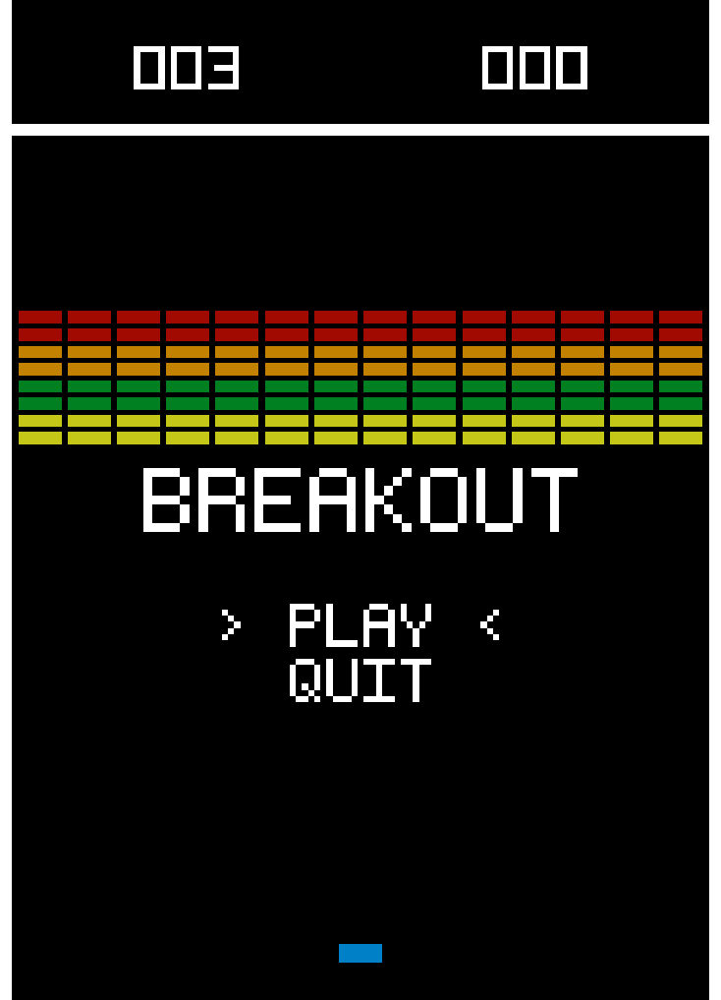

# breakout

- breakout - that's it - in C.

- don't look at the code though :D

- text is done by drawing quads.

- collision is continuous - pretty cool!

- no libraries. opengl procs loaded manually. windows only.

License: MIT. Any libraries used may of course have different licenses. - wait, there are no libraries 👀
